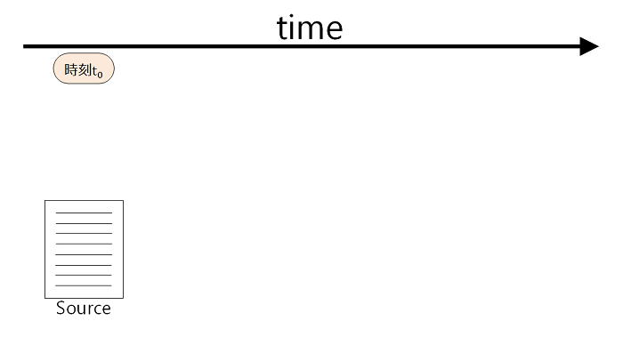
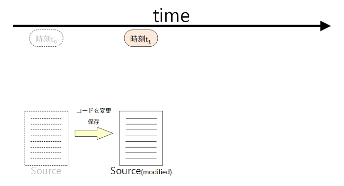
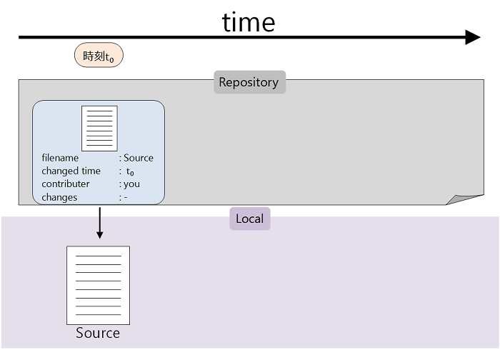
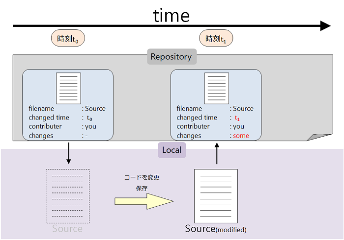

Chapter 1.1 - Fundamentals - Version Control System
=======

Gitは元々Linuxのカーネル(OSの中核)のソースコードを管理するために開発されたもので、小さなアプリケーションのソースコード管理から巨大プロジェクトに至るまで、その規模に関わらず高速かつ容易にバージョン管理をすることができます。

では、「バージョン管理」とは何なのでしょうか？

下の図では横軸として時間の流れ、左のほうに一つのプログラムのソースコードとそのソースコードが保存された時刻 **t0** が示されています。

時刻 **t1** の時にこのソースコードに変更を加えて保存したものを **Source(modified)** としましょう。

コンピュータには変更を加えたソースコードは保存されていますが、当然変更前の(t0時点の)ソースコードは上書きされてしまいます。

ふつうコンピュータで使われているファイルシステムには変更前のファイルのデータをどこかに保存しておいたり、その変更差分を記憶しておくなどの機能はありません。

* 変更を加えたらバグった/ビルドできなくなった。
* 変更内容に納得がいかないのでやっぱり元に戻したい。
* 分岐的な変更/バージョンアップなので変更前のバージョンを残しておきたい。
* どんな変更をどれだけ加えたか後で確認したい。

Gitのようなバージョン管理システムを用いていない状況下でこのような事になった場合、対処する術はほとんど無いと思います。尤も、毎回バックアップファイルを複製して作っておいたり何らかの方法で変更ログを記録していた場合などは例外ですが…。

プロジェクトのソースコードがそれほど複雑でない場合や変更履歴を追跡する必要が無い場合なら特に問題はないかと思いますが、規模が大きくなってくるとそういうわけにもいかなくなります。

では、次にバージョン管理システムを利用しているケースを見てみましょう。

図の上部にあるのはリポジトリです。ユーザーは、ファイルをリポジトリに登録することによってバージョン管理システムにそのファイルの変更履歴を監視・追跡させることができるわけです。上の図では、先の例でも用いたSourceというファイルをリポジトリに登録し、そのSourceをローカル環境に取り出した状況を表しています。(イントロで説明したバージョン管理システムの操作フローの1と2に当たります。)

順を追うと、

1. リポジトリを用意し、
2. 管理したいファイルをリポジトリに登録、
3. 登録したファイルをローカル環境に取り出す。

みたいな感じです。リポジトリ内のファイルをローカル環境に取り出すことによってファイルに対する変更を加えることが可能になります。

「リポジトリからファイルをローカル環境に取り出す」というのがイメージしにくいと思いますが、言葉と図を用いても分かりやすく説明するのが中々難しく、とりあえずは「ファイルを変更可能なステージに移動するということ」として覚えておいていただければ結構です。

リポジトリはリモートサーバーに置かれている場合もあれば、ローカルサーバーに置かれている場合もあります。Gitは分散型バージョン管理システムですので、リモートとローカルの両方にリポジトリを持ちます。

ところで先ほどから **リモート/ローカル** という単語を多用していますが、リモートというのは一般的に **ネットワークの向こう側** 、ローカルというのはネットワークを経由しなくてもアクセス可能な範囲 **(=そのコンピュータ自身など)** のことを意味します。なので、GitHubやBitbucketなどのGitホスティングサービスに置かれているリポジトリを **リモートリポジトリ** 、そのコンピュータ自身あるリポジトリを **ローカルリポジトリ** と呼ぶわけですね。

さて、バージョン管理のフローの話に戻りましょう。

上の図でファイルをローカル環境に取り出した後、先の例と同じようにSourceに変更を加えたとします。ローカル環境でのSourceはSource(modified)に上書きされてしまいますが、リポジトリには最初にSourceを登録したときの記録が残っていますね。これが普通のファイルシステムとの大きな違いで、変更前の記録がリポジトリに残っていることでローカル環境での変更を取り消すことによって変更前の時点までソースコードを戻すことができます。

ファイルに変更を加えたあとは、リポジトリにファイルを書き戻しましょう。そうすると、リポジトリには「誰が」「いつ」「何を」「どのように/どれだけ」変更したのかが記録されます。

ここまでで、バージョン管理システムの操作フローの1から4までの一連の操作が終わりました。以降は、フローの2から4までを同様に繰り返していくだけです。リポジトリからファイルを取り出し、変更をして、リポジトリに書き戻す。こうしてリポジトリにファイルの変更履歴が蓄積されていきます。リポジトリに格納された変更履歴は後から参照することができ、ユーザーは好きな変更履歴までソースコードの歴史を巻き戻したり、変更前のファイルとの変更差分を確認することもできます。また、リポジトリが管理できるのは一つのファイルだけではなく、複数のファイルを登録してそれぞれのファイルについての変更履歴を蓄積することができます。

大量のファイル群に何千・何万行ものソースコードが書かれているような大きなプロジェクトにおいて、このように変更履歴を記録していくことはとても重要です。変更したファイルをリポジトリに書き戻して変更履歴を記録するタイミングは人それぞれだと思いますが、機能ごと・マイルストーンごとに実装した部分から記録を重ねていくとプロジェクトの進捗状況が目に見えて分かりやすくなるのと同時に、後で「◯◯の時点では□□という状態だったので××するべきだ」といった見当をつけやすくなります。

以上がバージョン管理に関する説明です。フローの流れや厳密な操作に関して所々分かりにくい部分があったとは思いますが、大雑把なイメージが掴めたとは思います。