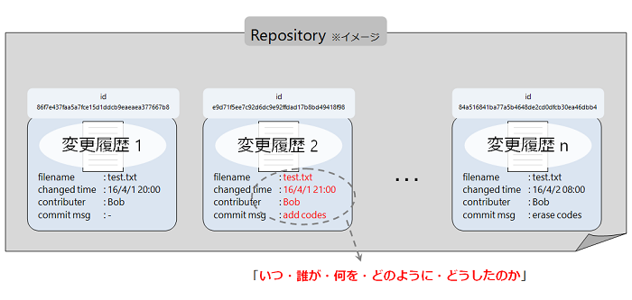

Chapter 1.1 - Fundamentals - Version Control
=======

Introductionでも触れた通り、Gitは **バージョン管理システム(VCS, Version Control System)** の一つです。

VCSを利用する最大のメリットは **ファイル毎の変更履歴を追跡できること** 、そして **複数人でも変更とその追跡が可能であること** にあります。

「変更を保存したファイルを変更前の状態に戻したい」といったようなケースにおいて最も簡単にそれを実現する方法というと、下の図のようにファイルのバックアップを作成しそれぞれに日付やインデックスを付与するといったようなものがありますが、これは手間が掛かる上に間違いが発生しやすく、ファイルの命名に一貫性を持たせないとすぐにディレクトリの秩序も乱れてしまいます。

では、Gitを利用するとどうでしょうか。

Gitは一つのリポジトリ( **repository** )で一つのディレクトリ(と、そのディレクトリが含むファイルとサブディレクトリ全て)の変更履歴を追跡することができます。

変更( **commit** )の履歴はrepositoryに記録されていき、それぞれにid( **commit id** )が付与されます。ユーザーはこのcommit idをもとにcommitのログを参照し、「いつ・誰が・何を・どのように・どうしたのか」を任意のタイミングで確認することができるわけです。

これならば、変更してしまったファイルを元に戻すことも、消してしまったファイルを復元させることでさえも可能ですね。

Gitにおけるrepositoryの実体は監視対象のディレクトリのファイル群とは明確に別なものとして存在しています(厳密には、その監視対象のディレクトリ直下の `.git` というディレクトリがrepositoryに相当します)。 **ディレクトリ自体がrepositoryになるというわけでは無い** という点は非常に重要なので押さえておきましょう。

### Various VCS

***TODO***

バージョン管理システムには、Gitのような分散型の他に、 **集中型バージョン管理システム(CVCS, Centralized Version Control System)** というものがあります。