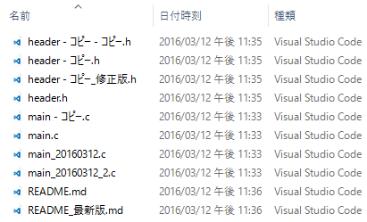
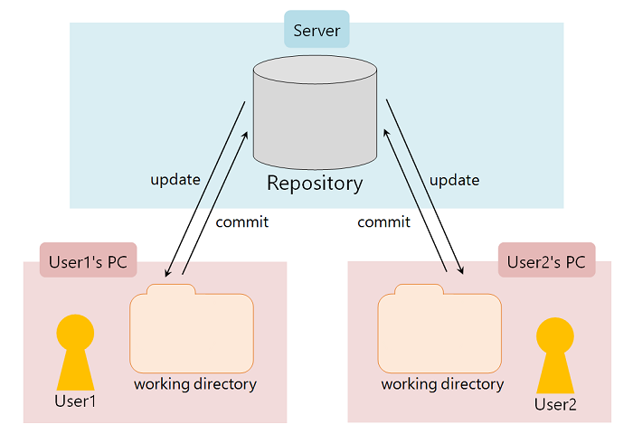
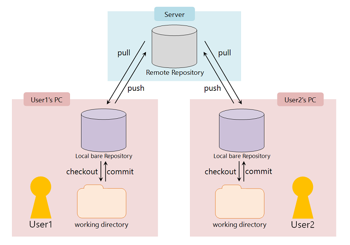

Chapter 1.1 - Fundamentals - Version Control
=======

Introductionでも触れた通り、Gitは **バージョン管理システム(VCS, Version Control System)** の一つです。

VCSを利用する最大のメリットは **ファイル毎の変更履歴を追跡できること** 、そして **複数人でも変更とその追跡が可能であること** にあります。

「変更を保存したファイルを変更前の状態に戻したい」といったようなケースにおいて最も簡単にそれを実現する方法というと、下の図のようにファイルのバックアップを作成しそれぞれに日付やインデックスを付与するといったようなものがありますが、これは手間が掛かる上に間違いが発生しやすく、ファイルの命名に一貫性を持たせないとすぐにディレクトリの秩序も乱れてしまいます。

では、Gitを利用するとどうでしょうか。

Gitは一つのリポジトリ **(repository**) で一つのディレクトリ(と、そのディレクトリが含むファイルとサブディレクトリ全て)の変更履歴を追跡することができます。

変更 **(commit)** の履歴はrepositoryに記録されていき、それぞれにSHA-1によって生成されたハッシュ値 **(commit id)** が付与されます。ユーザーはこのcommit idをもとにcommitのログを参照し、「いつ・誰が・何を・どのように・どうしたのか」を任意のタイミングで確認することができるわけです。

これならば、変更してしまったファイルを元に戻すことも、消してしまったファイルを復元させることでさえも可能です。

>### How does Git generate unique id ?
>
>commit idの生成に使われているハッシュ関数のSHA-1は、入力された文字列 (キー) から20バイトのハッシュ値を生成するハッシュ関数で、Gitの場合はその生成に使うキーとしてrepository内のデータベースに格納するコンテンツにヘッダーを付加した文字列を入力します。SHA-1によって生成されたハッシュ値は重複することがないので、上記の通り特定のcommitを参照するためのcommit idとして使われます。
>
>

Gitにおけるrepositoryの実体は監視対象のディレクトリ **(working directory)** のファイル群とは明確に別なものとして存在しています(厳密には、その監視対象のディレクトリ直下の `.git` というディレクトリがrepositoryに相当します)。 **ディレクトリ自体がrepositoryになるというわけでは無い** という点は非常に重要なので押さえておきましょう。

### Verb or Noun ?

上ではrepositoryに格納する変更のことを **commit** と言いましたが、実はrepositoryに変更を格納する操作自体のことも **「commit / commitする」** と表現します。以降の解説でもcommitという単語はたくさん出てきますが、それぞれ適当に解釈して読むようにしてください。

### NOT just commit, but update

一人でソースコードを管理する場合は、基本的にworking directoryに置いてあるファイルに変更を加えてrepositoryにcommitする事を繰り返すだけで良いのですが、複数人で管理する場合はそういうわけにもいきません。

自分がcommitした後に、同じrepositoryに対して別のユーザーがcommitした場合を想定します。時系列順的にはその別のユーザーがcommitした内容が最新のソースコードとなっていますので、自分のworking directoryにあるソースコードは最新の状態ではなくなってしまいます。この場合、repositoryにある最新のcommit内容をworking directoryのソースコードに反映させるために更新 **(update)** する操作が必要となります。

チームでプロジェクトのソースコードを管理する場合などは、自分が編集作業を行っていない間に別のユーザーがrepositoryにcommitしていたかどうかを毎回updateして確認するようにしましょう。

### Various VCSs

バージョン管理システムは、リポジトリの管理方法によって分散型バージョン管理システム(DVCS)と **集中型バージョン管理システム(CVCS, Centralized Version Control System)** に分けられます。

CVCSは、リモートサーバーに置かれたrepository **(remote repository, remote)** に対して直接変更履歴を記録します。

Apache Subversion(SVN)やConcurrent Versions System(CVS)などはこのCVCSの一種で、各ユーザーはworking directory内でファイルに対して加えられた変更を直接remote repositoryにcommitすることによってバージョン管理を行います。

CVCSはcommitとupdateの操作にremote repositoryが置かれているサーバーへの接続が必要なので、そのサーバーに接続できないような環境ではremote repositoryに対するcommitや最新のcommitの取得ができなくなってしまいます。

一方DVCSでは、CVCS同様にサーバーに置かれたremote repositoryの他に、各ユーザーのコンピュータ上にローカルリポジトリ **(local repository, local)** が保持されます。

各ユーザーのコンピュータ上にあるlocal repositoryはサーバー上にあるremote repositoryの複製 **(clone)** であり、サーバーに接続可能な状況下においてlocalからremoteへ **push** 、もしくはremoteからlocalに **fetch** することによってその同期を図ります。

DVCSではユーザーはサーバーに接続可能か否かに関わらずlocal repositoryに対してcommitをして、任意のタイミングでlocal repositoryの内容をremote repositoryに反映 **(push)** することができ、また同様に他のユーザーがremote repositoryに対して反映させたcommitを自分のlocal repositoryに反映 **(fetch)** することができます。

この、 **「各ユーザーのコンピュータ上にrepositoryが存在する」** というのがDVCSが分散型たる所以であり、CVCSには無いような以下のメリットがあります。

* サーバー上のremote repositoryにアクセス出来ない状況でもcommitやcommitのログ参照ができる
* サーバーが壊れたとしても、いずれかのlocal repositoryを複製してremote repositoryを復元することができる
* ブランチ **(branch)** というシステムを利用できる <small>(※後のchapterで解説します)</small>

 

バージョン管理の概念をすぐに理解することは中々簡単なことではないかもしれませんが、本頁を何度も読み返すなり講師に質問するなりしてバージョン管理の基本概念をきちんと理解できるように頑張りましょう。

次の [Chapter 1.2](./01_2.md) では、Gitのシステムや特有の概念などをコマンドの例などを交えながら解説していきたいと思います。