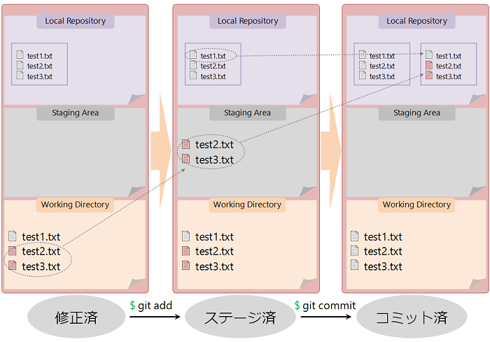
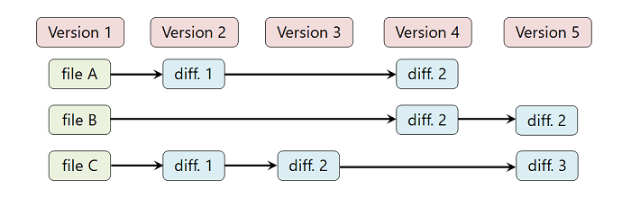
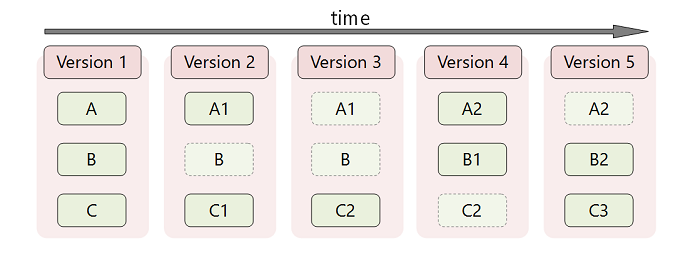
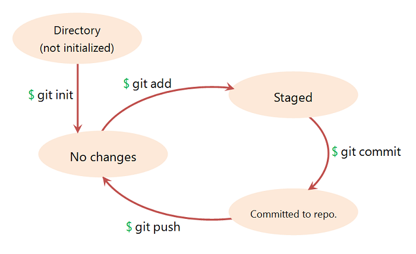

Chapter 1.2 - Fundamentals - Git ~ Distributed VCS
=======

Gitを用いてバージョン管理されるファイルは、3つの状態を持ちます。

* 修正済<br>　... working directory内で変更され、まだgit repositoryにcommitされていない状態
* ステージ済<br>　... 次のcommitでgit repositoryに記録するためにチェックされている状態で、ステージ済のファイルはステージングエリアに追加されている
* コミット済<br>　... git repositoryにcommitされ、データが安全に格納されている状態

修正済、コミット済の状態は前頁を読めば理解するのは難しくはないと思います。「ステージ」というのはGit特有の概念で、修正済の状態のファイルをステージングエリア **(staging area)** に追加する操作のことを言い、 `git add` コマンドを使って対象のファイル名を指定することによってファイルのステージをすることができます。staging areaに追加された変更が次のcommitでgit repositoryに記録されることになります。

working directory内のファイルを変更してからgit repositoryにcommitするまでの流れをまとめると、

1. ファイルに変更を加える<br>`$ emacs test2.txt test3.txt`
2. ファイルをstaging areaに追加する<br>`$ git add test2.txt test3.txt`
3. commitする<br>`$ git commit -m  "commit message"` or `$ git commit`

> Gitで変更をcommitするときにはコミットメッセージの入力を要求されます。上記のように `-m` オプションでコミットメッセージを入力するか、 `$ git commit` とだけ入力した際に立ち上がるエディタを使ってコミットメッセージを編集するようにしてください。



赤いファイルはまだ変更がgit repositoryに記録されていないファイルを表しています。

前頁では編集したファイルの変更をそのままrepositoryにcommitするような図が示されていたと思いますが、実際には **「どのファイルの変更をcommitするかを選択する」** という操作が挟まっていたわけです。working directoryでファイルを変更しても、そのファイルをstaging areaに追加しなければgit repositoryに変更が記録されることはありません。上の図では変更を加えたファイルを2つともstaging areaにaddしていますが、片方のファイルだけを選択してstaging areaに追加した場合はそのファイルの変更情報のみがgit repositoryに記録されることになります。

### Storing method

大半のVCSは **「変更前のファイルからの変更差分(変更部分)」** をコンテンツとしてrepositoryに対してcommitをし、バージョン管理をファイル単位で行っています。しかしGitは若干バージョン管理の考え方が異なり、repositoryには **「commit時のworking directoryそのもののスナップショット(コピー・複製)」** がcommitのコンテンツとして保存され、ディレクトリ単位でバージョン管理が行われています。



上の図は一般的なVCSの例です。最初にrepositoryにファイルを登録したVersion 1を起点として、commitの度に差分にバージョンが付けられていきます。差分というのは「前のバージョンからどれだけ変更があったか」の情報で、この例ではcommit時に前のバージョンからの差分が存在しないファイルについてはrepositoryに対してそのファイルに関する新しいバージョンの情報は記録されないことになります。



一方Gitでは、他のVCSのようなファイルの変更差分ではなく変更されたファイルを含むworking directoryそのもののスナップショットがgit repositoryに保存されます。ファイルに変更をした/しないに関わらずrepositoryにはworking directory内のファイルが全てツリー構造ごとそのままcommitのコンテンツとして保存されることになります。

Gitを使っていく上ではユーザーが意識する必要はありませんが、Gitが持つ特徴の一つとして頭の片隅に入れておきましょう。

<small>※ 上の2つの図は「[Pro Git 1.3 - Gitの基本](https://git-scm.com/book/ja/v1/%E4%BD%BF%E3%81%84%E5%A7%8B%E3%82%81%E3%82%8B-Git%E3%81%AE%E5%9F%BA%E6%9C%AC)」の図を参考にさせていただきました。</small>

### Life Cycle of Git

local repositoryにcommitされた内容はremote repositoryにpushすることによってその内容を同期させることができます。

```
例)
$ git push origin master
```

`git push` コマンドは第一引数にremote repositoryの名前、第二引数としてブランチ名([Managing branches](../04/04_0.md)のchapterで後述)などを取ります。remote repositoryの名前は `git remote add` コマンドで追加されたものや、remote repositoryの置かれているURLを書くことで指定することができます。

working directoryのファイルに変更を加えて「 **add** - **commit** - **push** 」までの一連を流れを繰り返していくことでrepositoryに次々に変更の歴史を蓄積する循環的なプロセスをこの資料では **「Gitのライフサイクル」** と呼称することにします。



作業を始める前はworking directoryのファイルに変更は一切無く、変更が終わったら `add` して `commit` して `push`。この過程を1サイクルとして何度も繰り返していくことを意識するようにしましょう。

上の図で示されている `git init` コマンドは、カレントディレクトリをGitで管理するためにgit repositoryなどの自動生成を行うためのコマンドです。例えば `/home/user/sample_dir` の下で `git init` コマンドを使った場合、 `sample_dir` ディレクトリはlocal repositoryとしてGitをつかってバージョン管理されるようになります。 `git init` コマンドはバージョン管理をしたいディレクトリの中で最初の一回だけ実行すれば大丈夫です。

他のディレクトリをバージョン管理する場合には、その都度最初に `git init` コマンドを実行するようにしましょう。

> ### Gitで管理されていないディレクトリ
>
>```
>.
>├── sample.txt
>└── test
>    └── test2
>```

<br>

> ### `git init` を打ったあとのディレクトリ
>
> ```
>.
>├── .git
>│   ├── HEAD
>│   ├── branches
>│   ├── config
>│   ├── description
>│   ├── hooks
>│   │   ├── applypatch-msg.sample
>│   │   ├── commit-msg.sample
>│   │   ├── post-update.sample
>│   │   ├── pre-applypatch.sample
>│   │   ├── pre-commit.sample
>│   │   ├── pre-push.sample
>│   │   ├── pre-rebase.sample
>│   │   ├── prepare-commit-msg.sample
>│   │   └── update.sample
>│   ├── info
>│   │   └── exclude
>│   ├── objects
>│   │   ├── info
>│   │   └── pack
>│   └── refs
>│       ├── heads
>│       └── tags
>│
>├── sample.txt
>└── test
>    └── test2
>
>```

<br>

Gitとは何なのか、ざっくりとしたイメージは掴めたでしょうか？ブランチ管理やプルリクエストの出し方などまだまだこの先覚えることはたくさんありますが、これまでの説明さえなんとなく理解できていればGitの基本的な使い方でつまづくようなことはないと思います。

分からないところや難しいところがあれば、何度も読み返しやディスカッションをして理解するように努めてみてください。