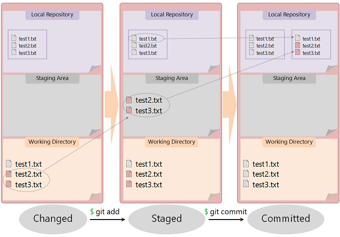

Chapter 1.2 - Fundamentals - Git ~ Distributed VCS
=======

Gitを用いてバージョン管理されるファイルは、3つの状態を持ちます。

* 修正済 　... working directory内で変更され、まだlocal repositoryにcommitされていない状態
* ステージ済 　... 次のcommitでlocal repositoryに記録するためにチェックされている状態で、ステージ済のファイルはステージングエリアに追加されている
* コミット済 　... local repositoryにcommitされ、データが安全に格納されている状態

修正済、コミット済の状態は前頁を読めば理解するのは難しくはないと思います。「ステージ」というのはGit特有の概念で、修正済の状態のファイルをステージングエリア **(staging area)** に追加する操作のことを言い、 `git add` コマンドを使って対象のファイル名を指定することによってファイルのステージをすることができます。staging areaに追加された変更が次のcommitでlocal repositoryに記録されることになります。

working directory内のファイルを変更してからlocal repositoryにcommitするまでの流れをまとめると、

1. ファイルに変更を加える `$ emacs test.txt`
2. ファイルをstaging areaに追加する `$ git add test.txt`
3. commitする `$ git commit -m  "commit message"` or `$ git commit`

> Gitで変更をcommitするときにはコミットメッセージの入力を要求されます。上記のように `-m` オプションでコミットメッセージを入力するか、 `$ git commit` とだけ入力した際に立ち上がるエディタを使ってコミットメッセージを編集するようにしてください。

赤いファイルはまだ変更がlocal repositoryに記録されていないファイルを表しています。

前頁では編集したファイルの変更をそのままrepositoryにcommitするような図が示されていたと思いますが、実際には **「どのファイルの変更をcommitするかを選択する」** という操作が挟まっていたわけです。working directoryでファイルを変更しても、そのファイルをstaging areaに追加しなければlocal repositoryに変更が記録されることはありません。上の図では変更を加えたファイルを2つともstaging areaにaddしていますが、片方のファイルだけを選択してstaging areaに追加した場合はそのファイルの変更情報のみがlocal repositoryに記録されることになります。

### Storing method

大半のVCSは **「変更前のファイルからの変更差分(変更部分)」** をコンテンツとしてrepositoryに対してcommitをし、バージョン管理をファイル単位で行っています。しかしGitは根本的にバージョン管理の考え方が異なり、repositoryには **「commit時のworking directoryそのもののスナップショット(コピー・複製)」** がcommitのコンテンツとして保存されます。