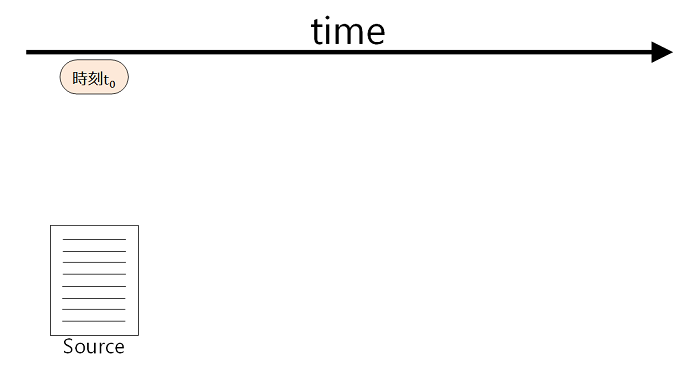

Chapter 2.1 - Details of Git - What
=======

Gitとは何なのかを分かりやすく説明するのはかなり難しく、端的に説明しようとすると、「**ファイル変更時のプロジェクトのスナップショットを時系列順に格納するシステム**」といったようによく分からない感じになってしまいます。

Gitは元々Linuxのカーネル(OSの中核)のソースコードを管理するために開発されたもので、小さなアプリケーションのソースコード管理から巨大プロジェクトに至るまで、その規模に関わらず高速かつ容易にバージョン管理をすることができます。

では、「バージョン管理」とは何なのでしょうか？簡単な例を挙げてみましょう。

下の図では横軸として時間の流れ、左のほうに一つのプログラムのソースコードとそのソースコードが保存された時刻 **t0** が示されています。

時刻 **t1** の時にこのソースコードに変更を加えて保存したものを **Source(modified)** としましょう。

コンピュータには変更を加えたソースコードは保存されていますが、当然変更前の(t0時点の)ソースコードは上書きされてしまいます。

ふつうコンピュータで使われているファイルシステムには変更前のファイルのデータをどこかに保存しておいたり、その変更差分を記憶しておくなどの機能はありません。

* 変更を加えたらバグった/ビルドできなくなった。
* 変更内容に納得がいかないのでやっぱり元に戻したい。
* 分岐的な変更/バージョンアップなので変更前のバージョンを残しておきたい。
* どんな変更をどれだけ加えたか後で確認したい。

Gitのようなバージョン管理システムを用いていない状況下でこんな事になった場合、対処する術はほとんど無いと思います。(尤も、毎回バックアップファイルを複製して作っておいたり何らかの方法で変更ログを記録していた場合などは例外ですが…)